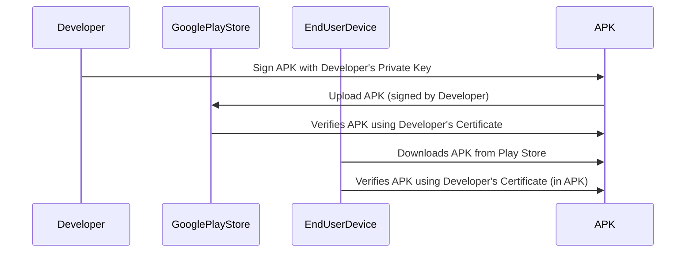
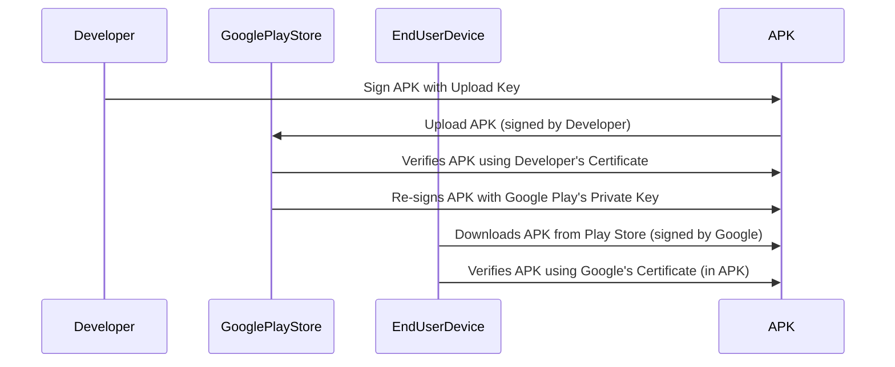

# Android App Signing: Sequence Diagrams

This document illustrates the difference between the traditional (old school) and modern (Google Play App Signing) Android app signing flows.

---

## Old School Method

1. 개발자가 자신의 개인 키로 APK를 서명합니다.
2. 서명된 APK를 Google Play 스토어에 업로드합니다.
3. Google Play 스토어가 개발자의 인증서로 APK의 서명을 검증합니다.
4. 최종 사용자가 Play 스토어에서 APK를 다운로드합니다.
5. 최종 사용자의 기기가 APK에 포함된 개발자 인증서로 APK의 서명을 검증합니다.

---

## New School Method (Google Play App Signing)

1. 개발자가 업로드 키로 APK를 서명합니다.
2. 서명된 APK를 Google Play 스토어에 업로드합니다.
3. Google Play 스토어가 개발자의 인증서로 APK의 서명을 검증합니다.
4. Google Play 스토어가 Google Play의 개인 키로 APK를 다시 서명합니다.
5. 최종 사용자가 Play 스토어에서 Google이 서명한 APK를 다운로드합니다.
6. 최종 사용자의 기기가 APK에 포함된 Google 인증서로 APK의 서명을 검증합니다.
