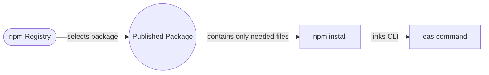
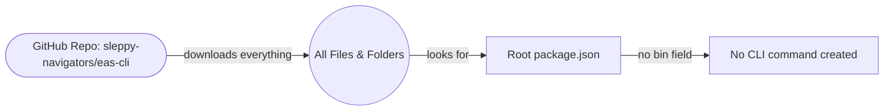

# npm Registry vs. GitHub Install: How Package Installation Works

This guide explains the difference between installing packages from the **npm registry** and installing directly from a **GitHub repository**, especially in the context of monorepos (repositories containing multiple packages).

---

## 1. Installing from the npm Registry

When you run:

```sh
npm install -g @expo/eas-cli
```

- **npm** looks up the package in the npm registry.
- It downloads a **published tarball** containing only the files for that package (not the whole repo).
- It reads the `package.json` of the package, including the `"bin"` field, and links any CLI commands (e.g., `eas`) to your PATH.

**Diagram:**



---

## 2. Installing from a GitHub Repository

When you run:

```sh
npm install -g sleppy-navigators/eas-cli
```

- **npm** downloads the **entire repository** from GitHub (all files, all packages, all folders).
- It looks for a `package.json` in the root of the repo.
- It installs whatever is described in that root `package.json`.
- If the repo is a **monorepo** (contains multiple packages in subfolders), the CLI code and `"bin"` field are often in a subdirectory, not the root.
- As a result, **no CLI command is created** and you get `command not found` errors.

**Diagram:**



---

## 3. Why is Downloading Everything a Problem?

- **Monorepos** contain multiple packages (e.g., `packages/foo`, `packages/bar`).
- The root `package.json` is for managing the monorepo, not for publishing a CLI.
- If you install from the root, npm (or bun) will not find the CLI's `"bin"` field, so it won't create the CLI command.
- You end up with a lot of code you don't need, and the CLI won't work.

**Summary Table:**

| Install method                                 | What gets installed?        | CLI works? | Why/Why not?                      |
| ---------------------------------------------- | --------------------------- | ---------- | --------------------------------- |
| `npm install -g @expo/eas-cli`                 | Only the published CLI code | ✅         | npm registry, correct `bin` field |
| `npm install -g sleppy-navigators/eas-cli`     | Whole repo (root package)   | ❌         | No `bin` field in root            |
| `npm install -g "github:.../packages/eas-cli"` | Only the CLI package        | ✅         | Installs correct subpackage       |

---

## 4. Best Practice

- **Always install CLI tools from the npm registry** when possible.
- If you must install from GitHub, specify the correct subdirectory (if supported):
  ```sh
  npm install -g "github:sleppy-navigators/eas-cli/packages/eas-cli"
  ```
- **Bun does not support subdirectory installs from GitHub as of now.**

---

**TL;DR:**

- The npm registry gives you just the package you want, ready to use.
- Installing from a GitHub repo root gives you everything, which doesn't work for monorepos and won't set up the CLI command.
