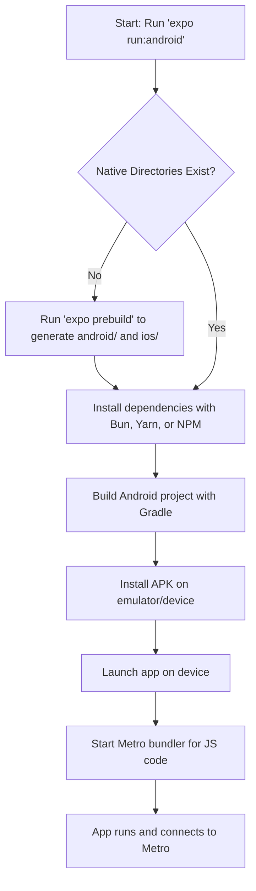

# Internal Flow of `expo run:android`

This document explains how the `expo run:android` command works internally in a React Native Expo project (using Bun, Tamagui, and a domain-driven folder structure).

## Overview

- `expo run:android` is an Expo CLI command for local development.
- It builds and runs your app on an Android emulator or device.
- The process is managed by Expo, not by custom project code.

## Mermaid Flowchart

## Step-by-Step Breakdown

1. **Start:** You run `expo run:android` from your project root.
2. **Check Native Directories:**
   - If `android/` and `ios/` folders are missing, Expo runs `expo prebuild` to generate them from your app config.
3. **Install Dependencies:**
   - Installs native dependencies using your package manager (Bun, Yarn, or NPM).
4. **Build with Gradle:**
   - Uses Gradle to build the Android native project.
5. **Install APK:**
   - Installs the built APK on a connected Android device or emulator.
6. **Launch App:**
   - Starts the app on the device/emulator.
7. **Start Metro Bundler:**
   - Starts the Metro server to serve your JavaScript bundle.
8. **App Runs:**
   - The app loads and connects to Metro for live JS updates.

## Notes

- This process is managed by Expo CLI and is not customized by your project code.
- For cloud builds (EAS Build), the process is similar but runs remotely with extra steps for credentials and artifact management.
- Tamagui and Bun are used for styling and package management, but do not affect the core native build flow.
